<picture>
  <source media="(prefers-color-scheme: dark)" srcset="./dark.svg">
  <source media="(prefers-color-scheme: light)" srcset="./light.svg">
  
</picture>

# SIDDHARTH TIWARI

> Your professional headline — replace this with a concise, factual description of your work.

## About

- **Focus:** Your core engineering/design/research focus
- **Building:** Your current project or area
- **Stack:** Your strongest technologies

## Experience

Add only roles and organizations that you explicitly provide.

## Featured Projects

- **Project One** — Short factual description
- **Project Two** — Short factual description

## Engineering Stack

`Technology 01` · `Technology 02` · `Technology 03`

## Connect

- GitHub: https://github.com/Siddtiwari25
- LinkedIn: https://www.linkedin.com/in/siddharth-tiwari-aiml25/
- Portfolio: https://siddharth-tiwari-github-io.vercel.app/

